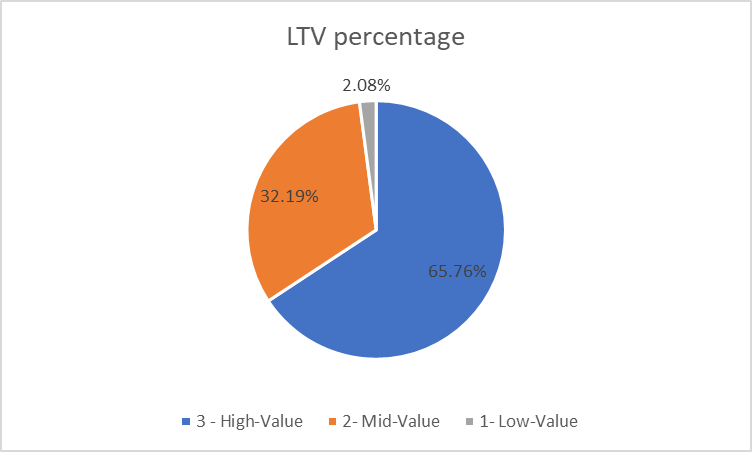

# Sales Analysis Using Microsoft Contoso_100k Database

## Overview 
The report contains an analysis of customer behavior, retention, and lifetime values for an e-commerce company to improve customer retention and maximize revenue.

## Business Questions 
1. **Customer Segmentation**: Who are our most valuable customers?
2. **Cohort Analysis**: How do different customer groups generate revenue?
3. **Retention Analysis**: Who hasnt purchased recently? 

## Analysis Approach

### 1. Customer Segmentation 
- Categorized customers based on total lifetime value (LTV).
- Assigned customers to High, Mid, and Low-value segments.
- Calculated key metrics: Total Revenue.

Query: [1_Customer_Segmentation.sql](/1_Customer_Segmentation%20.sql)

**Visualisation:** 

**Key Findings**
- High-Value segment (25% of customers) drives 66% of revenue ($135.4M).
- Mid-Value segment (50% of customers) generates 32% of revenue ($66.6M)
- Low-Value segment (25% of customers) accounts for 2% of revenue ($4.3M)

**Business Insights** 
- High-Value (66% revenue): Focus on retention as losing one customer impacts revenue significantly. 
- Mid-Value (32% revenue): Create upgrade paths for 24,743 customers through personalized promotions for effective targeting. 
- Low-Value (2% revenue): Target enagemement campaigns for 12,372 customers to increase pruchase frequency. 

### 2. Cohort Analysis 
- Tracked revenue and custtomer count per cohorts.
- Cohorts were grouped by year of first purchase. 
- Analyzed customer retention at a cohort level.

Query: [2_cohort_analysis.sql](/2_cohort_analysis.sql)

**Visualisations:**

**Key Findings**
- Customer Growth: The number of customers grew significantly from 2015 to 2019, peaking in 2019 (7,755 customers). After a dip in 2020-2021, it surged again in 2022 (9,010 customers), then declined sharply in 2024 (1,402 customers).
- 2022- 2024 cohorts are consistently performing worse than earlier cohorts. 
- Revenue Trends: Total revenue followed a similar pattern, peaking in 2019 (22.26M) and 2022 (22.26M) and 2022 (20.57M), with the lowest revenue in 2024 ($2.63M).
- NOTE: Although net revenue is increasing, this is likely due to a larger customer base, which is not reflective of customer value. 

**Business Insights** 
- Value extracted from customers is decreasing over time and needs further investigation. 
- In 2023 we saw a drop in number of customers acquired, which is concerning.
- With both lowering LTV and decreasing customer acquisition, the company is facing a potential revenue decline. 

### 3. Retention Analysis 
- Identified customers at the risk of churning.
- Analyzed last purchase pattern.
- Calculated customer specific metrics.

Query: [3_retention_analysis](/3_retention_analysis.sql)

**Visualization**

**Key Findings**
- High Churn Rates: Across all cohort years (2015-2023), the churn rate is consistently very high, ranging from 90% to 92%. Only 8-10% of customers remain active.

- Slight Improvement in Recent Years: The 2022 and 2023 cohorts show a marginally lower churn rate (90%) compared to earlier years (91-92%), suggesting a small improvement in retention.

- Scale of Churn: The total number of customers has grown over time (from 2,825 in 2015 to 9,010 in 2022), but the churn proportion remains stubbornly high.

**Business Insights** 
- Strengthen Early Engagement by fixing onboarding to show value faster by guiding users to quick wins (e.g., tutorials, milestones) through personalized offers. In addition, Survey early churners to find drop-off points.
- Provide Win-Back Offers targeted at-risk users (e.g., inactive for 60 days) with discounts or exclusive features.
- Predict churn risk and use customer-specific warning indicators to proactively intervew with at risk users before they lapse. 

## Strategic Reccomendations 
**1. Customer Segmentation**:  Focus on retaining High-Value customers (25% of customers driving 66% of revenue) through VIP perks and churn prediction, while upselling Mid-Value customers (50% of customers, 32% revenue) with targeted upgrades. Low-Value segments (25% of customers, 2% revenue) should only receive low-cost engagement efforts. A 5% reduction in High-Value churn could recover $6.7M+ annually, making retention the highest ROI lever. Prioritize High-Value loyalty and Mid-Value conversion—not broad engagement—to maximize revenue efficiently. 
**2. Cohort Analysis**: Despite growing total revenue through customer base expansion, declining customer lifetime value (LTV) and shrinking acquisition signal unsustainable growth. The sharp drop in 2024 customers (-84% vs. 2022) and worsening cohort performance suggest deteriorating product-market fit or increased competition. To stabilize revenue, shift focus from scaling acquisition to improving retention and monetization—especially in newer cohorts—through win-back campaigns, pricing optimization, and enhanced onboarding. Without intervention, revenue will decline as customer growth stalls and LTV erodes.

**3. Retention Analysis**: With churn persistently at 90%+ across all cohorts, acquisition growth alone is unsustainable. While recent cohorts show slight improvement (90% vs 92%), the scale of defection demands urgent action. Implement a three-tiered retention strategy: (1) prevent early churn through hyper-personalized onboarding that delivers quick wins, (2) interrupt mid-funnel attrition with dynamic win-back offers triggered by usage drops, and (3) predict defection risks using AI models to enable pre-emptive saves. The marginal 2% improvement in newer cohorts proves churn is addressable—doubling down on these tactics could unlock 10-15% retention gains, turning revenue stabilization into growth.
## Technical Details 
- **Database:** PostgreSQL
- **Analysis Tools:** PostgreSQL, DBeaver, PGadmin
- **Visualization:** Excel and Chatgpt